# No Cloud Required: Building an AI Security Scanner That Runs Entirely on Your Hardware

Many security scanning tools I've used assume my code can leave my machine. Cloud-hosted SAST platforms, SCA dashboards, managed code-review services - they all want to pull source into someone else's infrastructure to analyze it. And for most teams, that tradeoff is perfectly fine. 

But I kept thinking about the cases where it isn't: proprietary algorithms, pre-patent code, government projects on air-gapped networks, or just that uneasy feeling when a third-party service has a breach and you realize they had a copy of your entire codebase.

I wanted something different. *What if I could run a real security scanner - one that actually understands code, not just regex patterns - entirely on my own machine?* No cloud APIs, no telemetry, no "we take your privacy seriously" banners. Just my code, my hardware, and a local LLM doing the analysis.

So I built one. A three-layer scanning pipeline that combines fast regex matching, semantic rule retrieval via vector search, and deep contextual analysis using a local LLM. It runs behind a FastAPI API, ships in Docker, and the LLM runs native on macOS with Metal GPU acceleration. The whole thing - from `POST /scan` to a Markdown report - happens without a single byte leaving your machine.


In this article, I'll walk through how I designed and built this local security scanner, why the three-layer architecture matters, and how you can run it on your own code. Let's get into it.

## What We're Building

Here's the high-level view:

```
Your Python Codebase
        |
   FastAPI (port 8000)
        |
   CodeAnalyzer
        ├── Layer 1: Regex PatternMatcher (fast, broad)
        ├── Layer 1.5: tree-sitter Complexity Detection
        ├── Layer 2: ChromaDB Semantic Rule Matching
        ├── Layer 3: Ollama LLM Deep Analysis
        └── Layer 3.5: LLM False Positive Validation
        |
   Reports (JSON + Markdown)
```

The **CodeAnalyzer** is the orchestrator. It takes a directory path, collects all the Python files, and runs them through each layer. The **PatternMatcher** does fast regex sweeps against 30 OWASP Top 10 rules. **tree-sitter** parses the actual AST to detect complexity issues - functions that are too long, too nested, or have too many parameters. **ChromaDB** embeds all 30 security rules as vectors and uses cosine similarity to find which rules are most relevant to a given code snippet. And **Ollama** with **DeepSeek-Coder** does the actual "does this code have a real vulnerability?" analysis - the kind of reasoning that regex can't do.

Think of it like airport security. Layer 1 is the metal detector - fast, catches the obvious stuff. Layer 2 is the X-ray machine deciding which bags need a closer look. Layer 3 is the human agent who actually opens your bag and checks.

```mermaid
graph LR
    A["📁 Python Files"] --> B["🔍 Regex Scan"]
    B --> C["🌳 AST Complexity"]
    C --> D["🧲 ChromaDB Semantic Match"]
    D --> E["🤖 LLM Deep Analysis"]
    E --> F["📋 Reports"]
```



## Why Three Layers Instead of Just Using the LLM?

This was the first design question I had to answer. If you have a local LLM, why not just feed it every file and ask "find the vulnerabilities"?

Two reasons: speed and cost. Even on an M-series Mac with Metal acceleration, DeepSeek-Coder takes a few seconds per prompt. If you have a codebase with 200 Python files and 30 security rules, that's 6,000 LLM calls. At 3 seconds each, you're looking at 5 hours for a single scan. Nobody is waiting 5 hours.

The three-layer design solves this. Layer 1 (regex) scans all 200 files against all 30 rules in under a second. Layer 2 (ChromaDB) narrows down which rules are actually relevant to each file - instead of checking all 30 rules per file, you check the top 5 that semantically match. Layer 3 (LLM) only fires on that filtered set. Now you're down to maybe 50-100 LLM calls instead of 6,000.

Here's what the analyzer's main loop looks like:

```python
# === Layer 1: Regex pattern matching ===
for file_path in files:
    matches = self._matcher.scan_file(file_path)
    all_matches.extend(matches)

    if file_path.suffix == ".py":
        analysis = self._ts_parser.parse_file(file_path)
        file_analyses[str(file_path)] = analysis

# === Layer 2+3: Semantic matching + LLM analysis ===
if self._llm_available and self._vector_store and self._llm_analyzer:
    for file_path in files:
        code = file_path.read_text(encoding="utf-8", errors="ignore")

        # Layer 2: Query vector store for relevant rules
        relevant_rules = self._vector_store.query_relevant_rules(
            code[:2000], n_results=5
        )

        # Filter to rules that need LLM analysis
        llm_rules = [r for r in relevant_rules if r.detection.llm_prompt]

        if llm_rules:
            # Layer 3: LLM deep analysis
            file_llm_findings = self._llm_analyzer.analyze_code_with_rules(
                code, llm_rules, str(file_path)
            )
            llm_findings.extend(file_llm_findings)
```

The `query_relevant_rules` call is doing the heavy lifting for efficiency. It embeds the first 2,000 characters of each file and finds the 5 closest security rules using cosine similarity. Only rules that have an `llm_prompt` - meaning they actually need LLM reasoning to detect - get sent to the model.

## The LLM Talks JSON (Most of the Time)

Here's the thing about local LLMs: they're not as disciplined as GPT-4 or Claude when it comes to structured output. DeepSeek-Coder is a code model, not an instruction-following champion. So I had to build defensive JSON parsing.

```python
@staticmethod
def _parse_json_response(raw: str) -> Optional[Dict]:
    """Defensively parse JSON from an LLM response."""
    text = raw.strip()

    # Strip markdown code fences
    if "```json" in text:
        start = text.index("```json") + 7
        end = text.index("```", start) if "```" in text[start:] else len(text)
        text = text[start:end].strip()

    # Try direct parse
    try:
        return json.loads(text)
    except json.JSONDecodeError:
        pass

    # Try to find JSON object in the text
    for i, char in enumerate(text):
        if char == "{":
            depth = 0
            for j in range(i, len(text)):
                if text[j] == "{":
                    depth += 1
                elif text[j] == "}":
                    depth -= 1
                    if depth == 0:
                        try:
                            return json.loads(text[i : j + 1])
                        except json.JSONDecodeError:
                            break
            break

    return None
```

The model sometimes wraps its JSON in markdown code fences. Sometimes it adds a friendly preamble before the JSON. Sometimes it decides to explain its reasoning after the closing brace. The parser handles all of these cases by stripping fences first, then trying direct parsing, then falling back to brace-matching to extract the JSON object from whatever surrounding text the LLM decided to add.

Every LLM prompt asks for a specific JSON schema. For vulnerability detection, it looks like this:

```json
{
  "vulnerable": true,
  "confidence": "high",
  "line_number": 42,
  "explanation": "User input is concatenated directly into SQL query",
  "remediation": "Use parameterized queries instead"
}
```

Low-confidence findings get dropped automatically. If the model says "I think maybe there could be an issue" - that's a `"confidence": "low"` and we skip it. Only medium and high confidence findings make it into the report.

## Graceful Degradation - The Scanner Always Works

One thing I'm proud of: the scanner works at three different capability levels depending on what's available on your machine.

| Mode | When | What Works |
|------|------|------------|
| Full | Ollama running + model pulled | All 3 layers + LLM validation + reports |
| Degraded | Ollama offline | Regex + complexity detection (still useful) |
| Minimal | No optional deps | Regex scanning only |

This matters because the LLM is the most fragile component. Ollama might not be running. The model might not be pulled. The GPU might be busy. I didn't want the whole scanner to crash because Layer 3 was unavailable.

```python
def _init_llm_components(self) -> None:
    """Initialize LLM analyzer and vector store if available."""
    try:
        self._llm_analyzer = LLMAnalyzer()
        self._llm_available = self._llm_analyzer.is_available

        if self._llm_available:
            logger.info("LLM is available - enabling deep analysis")
        else:
            logger.warning(
                "LLM not reachable - falling back to regex + complexity only"
            )

        # Always init vector store (uses local embeddings, no LLM needed)
        self._vector_store = VectorStore()
        self._vector_store.index_rules(self._rule_loader.rules)
    except Exception as e:
        logger.warning("Failed to initialize LLM components: {}", e)
        self._llm_available = False
```

The `VectorStore` uses sentence-transformers (`all-MiniLM-L6-v2`) for embeddings - that's a small local model that doesn't need Ollama. So even in degraded mode, the semantic matching layer still works. Only the actual LLM analysis drops out.

## The Hybrid Docker Architecture

Here's a decision that tripped me up early on: where does Ollama run? My first instinct was to put everything in Docker. But Ollama on macOS uses Metal GPU acceleration - it talks directly to the Apple silicon GPU. Inside a Docker container on macOS, you lose that. Docker Desktop for Mac doesn't support GPU passthrough the way Linux does with NVIDIA Container Toolkit.

So the architecture is hybrid:

```
┌─────────────────────────┐     ┌──────────────────────┐
│  Docker Container        │     │  Host Machine (bare)  │
│                          │     │                       │
│  FastAPI (port 8000)     │────>│  Ollama (port 11434)  │
│  tree-sitter, ChromaDB   │     │  deepseek-coder:6.7b  │
│  PyMuPDF, WeasyPrint     │     │  Metal GPU accel      │
└─────────────────────────┘     └──────────────────────┘
       host.docker.internal:11434
```

FastAPI, ChromaDB, tree-sitter, and all the Python dependencies live in the container. Ollama runs native on the host. The container connects to Ollama via `host.docker.internal:11434` - a special DNS name Docker provides that resolves to the host machine.

```yaml
services:
  scanner:
    build: .
    ports:
      - "8000:8000"
    environment:
      - OLLAMA_HOST=http://host.docker.internal:11434
      - OLLAMA_MODEL=${OLLAMA_MODEL:-deepseek-coder:6.7b}
    extra_hosts:
      - "host.docker.internal:host-gateway"
```

That `extra_hosts` line is the key. On Linux, `host.docker.internal` doesn't resolve by default - you need to explicitly map it to `host-gateway`. On macOS it just works, but adding the mapping makes the compose file portable.

## What the Security Rules Look Like

The scanner ships with 30 built-in rules covering all 10 OWASP Top 10 categories. Each rule is a Pydantic model with three detection methods - regex, AST query, and LLM prompt:

```python
class DetectionMethod(BaseModel):
    """How a security rule is detected in code."""
    pattern: Optional[str] = None       # Regex pattern
    ast_query: Optional[str] = None     # Tree-sitter query
    llm_prompt: Optional[str] = None    # Prompt for LLM analysis
```

A rule can have any combination of these. Some rules - like hardcoded credentials - have a regex pattern (`r"(?:password|secret|api_key)\s*=\s*['\"]"`) that's fast and reliable. Others - like "missing input validation in API endpoint" - can only be detected by the LLM, so they have an `llm_prompt` but no `pattern`. The scanner uses whatever detection methods are available for each rule.

Every rule also maps to compliance frameworks:

```python
class ComplianceMapping(BaseModel):
    """Maps a rule to compliance framework controls."""
    iso_27001: List[str] = []   # e.g., ["A.14.2.5"]
    pci_dss: List[str] = []     # e.g., ["6.5.1"]
    soc_2: List[str] = []       # e.g., ["CC6.1"]
```

This is what makes the scanner useful beyond "hey you have a bug" - it ties findings directly to the compliance controls your auditor cares about.

## What the Reports Look Like

So all three layers have run, the findings are collected — now what? The scanner generates reports automatically after every scan. A `ReportManager` dispatches to format-specific generators, and right now there are two: **JSON** for machines and **Markdown** for humans. Both land in the `outputs/` directory, named after the scan ID.

The JSON report is a full serialization of the `ScanResult` model — metadata, scope, summary with security score, compliance percentages per framework, every finding with its code snippet and remediation, and the list of files analyzed. It's the format you'd pipe into a CI/CD dashboard or feed into another tool.

But the Markdown report is the one I actually read. Here's what a real scan looks like:

---

# Security Scan Report

**Scan ID**: `scan_20260218_143052`
**Date**: 2026-02-18 14:30:52 UTC
**Duration**: 47s
**Repository**: `src/`
**Files Scanned**: 18
**Lines of Code**: 3,412

## Executive Summary

**Security Score**: **68/100** (Needs Improvement)
**Total Findings**: 7

## Findings by Severity

| Severity | Count |
|----------|-------|
| CRITICAL | 1 |
| HIGH     | 2 |
| MEDIUM   | 3 |
| LOW      | 1 |

## Findings by Category

| Category                | Count |
|-------------------------|-------|
| Injection               | 2 |
| Cryptographic Failures  | 2 |
| Security Misconfiguration | 2 |
| Broken Access Control   | 1 |

## All Findings

| # | Severity | Rule | File | Line | Title |
|---|----------|------|------|------|-------|
| 1 | CRITICAL | `owasp-a03-001` | `db.py` | 42 | SQL injection via string concatenation |
| 2 | HIGH | `owasp-a02-001` | `auth.py` | 15 | Hard-coded database password |
| 3 | HIGH | `owasp-a02-003` | `config.py` | 8 | Weak hashing algorithm (MD5) |
| 4 | MEDIUM | `owasp-a05-002` | `app.py` | 67 | Debug mode enabled in production |
| 5 | MEDIUM | `owasp-a03-002` | `api.py` | 31 | Unsanitized user input in shell command |
| 6 | MEDIUM | `owasp-a01-001` | `views.py` | 89 | Missing authorization check |
| 7 | LOW | `owasp-a05-001` | `settings.py` | 12 | Verbose error messages exposed |

## Finding Details

### 1. [CRITICAL] SQL injection via string concatenation

- **Rule**: `owasp-a03-001`
- **File**: `src/db.py`
- **Line**: 42
- **CWE**: CWE-89

**Description**: User input is concatenated directly into a SQL query
string without parameterization, allowing an attacker to inject
arbitrary SQL commands.

**Code**:
```python
query = f"SELECT * FROM users WHERE name = '{user_input}'"
cursor.execute(query)
```

**Remediation**: Use parameterized queries: `cursor.execute("SELECT *
FROM users WHERE name = ?", (user_input,))`

### 2. [HIGH] Hard-coded database password

- **Rule**: `owasp-a02-001`
- **File**: `src/auth.py`
- **Line**: 15
- **CWE**: CWE-798

**Description**: Database credentials are hard-coded directly in the
source file. Anyone with access to the repository can read the
password, and rotating it requires a code change and redeployment.

**Code**:
```python
DB_PASSWORD = "supersecret123"
conn = psycopg2.connect(host="db", password=DB_PASSWORD)
```

**Remediation**: Move credentials to environment variables or a secrets
manager: `os.environ["DB_PASSWORD"]`

### 3–7. ...

*(Remaining findings follow the same format — each with rule ID,
file location, CWE, vulnerable code snippet, and remediation steps.)*

---

Each finding includes the rule ID, severity, exact file and line number, CWE identifier, a description of the vulnerability, the actual vulnerable code snippet, and specific remediation steps. Every finding also carries compliance mappings — which ISO 27001 controls, PCI DSS requirements, and SOC 2 criteria it violates — so when your auditor asks "show me your injection controls," you can point them to the report.

At the bottom, the report includes a **Remediation Summary** — a deduplicated list of fixes grouped by rule. If the same hardcoded-credentials rule triggered in five files, you see the remediation once, not five times.

The security score is a 0-100 number. 80+ is "Good." 60-79 is "Needs Improvement." 40-59 is "Poor." Below 40 is "Critical." It's a quick gut check — open the report, see the number, know whether to panic.

## Try It Yourself

Here's everything you need to go from zero to scanning your own code. There are two paths: run locally with Python, or run in Docker. Both work — the difference is whether you want to manage the Python environment yourself.

### Prerequisites

You'll need:
- **Python 3.11+** (for running locally)
- **Ollama** — the local LLM runtime. Download it from [ollama.ai](https://ollama.ai). This is what runs DeepSeek-Coder on your machine.
- **Docker Desktop** (optional) — only if you want the containerized setup

### Path 1: Run Locally

```sh
# Clone the repo and set up
git clone https://github.com/jaeyow/local-security-scanner
cd local-security-scanner
cp .env.example .env

# Create a virtual environment and install dependencies
python -m venv .venv
source .venv/bin/activate
pip install -r requirements.txt
```

Now set up Ollama. If you haven't installed it yet, grab it from [ollama.ai](https://ollama.ai), then:

```sh
# Pull the model (one-time download, ~3.5 GB)
ollama pull deepseek-coder:6.7b

# Start the Ollama server
ollama serve
```

Leave that running in a separate terminal. Now start the scanner:

```sh
uvicorn src.main:app --reload --host 0.0.0.0 --port 8000
```

That's it. The API is live at `http://localhost:8000`.

### Path 2: Run with Docker

Here's the thing — Ollama still runs on your host machine, not inside Docker. Why? Because Ollama on macOS uses Metal GPU acceleration, and Docker Desktop for Mac doesn't support GPU passthrough. So the container runs FastAPI, ChromaDB, and tree-sitter, while Ollama stays native.

```sh
# Make sure Ollama is running on the host first
ollama serve

# Then bring up the container
docker-compose up --build
```

The container connects to Ollama via `host.docker.internal:11434` — Docker's built-in DNS that resolves to your host machine. The API is at the same `http://localhost:8000`.

### Using the API: The Full Workflow

Once the server is running, here's the step-by-step workflow. I'll use `curl`, but you can also use the interactive Swagger UI at `http://localhost:8000/docs` — FastAPI generates it automatically and it lets you try every endpoint from the browser.

**Step 1: Check that everything is ready.**

```sh
curl -s http://localhost:8000/api/v1/health | python -m json.tool
```

```json
{
  "status": "healthy",
  "ollama_connected": true,
  "scanner_version": "1.0.0",
  "rules_loaded": 30
}
```

You want `ollama_connected: true` and `rules_loaded: 30`. If Ollama isn't running, you'll see `"status": "degraded"` — the scanner still works, but only the regex and complexity layers fire. No LLM analysis.

**Step 2: Start a scan.**

```sh
curl -s -X POST http://localhost:8000/api/v1/scan \
  -H "Content-Type: application/json" \
  -d '{"codebase_path": "src/"}' | python -m json.tool
```

```json
{
  "scan_id": "scan_20260218_143052",
  "status": "pending",
  "estimated_time": null,
  "message": "Scan queued successfully"
}
```

The scan runs in the background. Save that `scan_id` — you'll need it to check on progress.

You can also customize the scan:

```sh
curl -s -X POST http://localhost:8000/api/v1/scan \
  -H "Content-Type: application/json" \
  -d '{
    "codebase_path": "/path/to/your/project",
    "exclude_patterns": ["**/test_*.py", "**/vendor/**"],
    "output_formats": ["json", "markdown"]
  }' | python -m json.tool
```

**Step 3: Poll for results.**

Scans take anywhere from a few seconds (regex only) to a few minutes (with LLM analysis). Poll the status endpoint:

```sh
curl -s http://localhost:8000/api/v1/scan/scan_20260218_143052 | python -m json.tool
```

While it's running, you'll see `"status": "running"` and a `progress` field from 0-100. When it's done:

```json
{
  "scan_id": "scan_20260218_143052",
  "status": "completed",
  "progress": 100,
  "result": {
    "metadata": { "scan_id": "scan_20260218_143052", "duration_seconds": 47 },
    "summary": { "total_findings": 7, "security_score": 68 },
    "findings": [ ... ]
  },
  "report_urls": {
    "json": "outputs/scan_20260218_143052.json",
    "markdown": "outputs/scan_20260218_143052.md"
  }
}
```

The full findings are in the `result` object, and the generated report files are at the paths in `report_urls`.

**Step 4: Browse the rules.**

Want to see what the scanner checks for? List all loaded rules:

```sh
curl -s http://localhost:8000/api/v1/rules | python -m json.tool
```

```json
{
  "total": 30,
  "rules": [
    {
      "rule_id": "owasp-a01-001",
      "title": "Broken Access Control - Missing Authorization",
      "category": "Broken Access Control",
      "severity": "HIGH",
      "owasp_category": "A01"
    },
    ...
  ]
}
```

**Step 5 (optional): Upload your own rules from a PDF.**

Have a compliance PDF — say, your organization's internal security guidelines? Upload it and the scanner will extract rules automatically:

```sh
curl -s -X POST http://localhost:8000/api/v1/rules/upload \
  -F "file=@/path/to/security_guidelines.pdf" | python -m json.tool
```

```json
{
  "status": "success",
  "rules_extracted": 12,
  "processing_time": 3.41,
  "message": "Extracted 12 rules from security_guidelines.pdf"
}
```

Those rules get added to the scanner's rule set and will be used in future scans.

## What's Next

I built a local AI security scanner that combines regex speed with LLM intelligence, runs entirely on your machine, and degrades gracefully when components aren't available.

The beauty of this is that the three-layer architecture isn't just about security scanning. The same pattern - fast filter, semantic match, LLM analysis - works for any problem where you need LLM-quality reasoning but can't afford to run the LLM on every input.

Ideas for where to take this next:

- Add support for JavaScript, Go, and Rust codebases (tree-sitter already supports them)
- Build a CI/CD integration that runs scans on every pull request
- Add PDF report generation with charts and compliance dashboards
- Create a VS Code extension that highlights findings inline
- Swap DeepSeek-Coder for newer models as they come out - the model is configurable via `.env`

Full code is on GitHub: [local-security-scanner](https://github.com/jaeyow/local-security-scanner)

If you build something with it, I'd love to hear about it.
